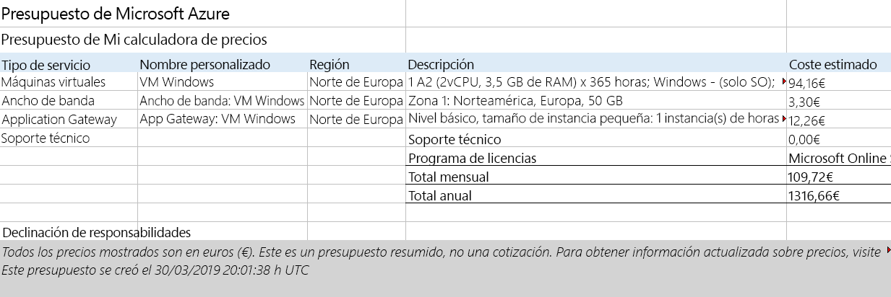

# Usar la calculadora de precios

En este tutorial, utilizaremos la Calculadora de precios de Azure para generar una estimación de costes para una máquina virtual Azure y recursos de red relacionados.

# Tarea 1: Configurar la calculadora de precios

En esta tarea, calcularemos el coste de una infraestructura de muestra con la Calculadora de precios de Azure. 

**Nota**: Para crear una estimación de la Calculadora de precios de Azure, este tutorial ofrece configuraciones de ejemplo para la VM y recursos relacionados. Use estas configuraciones de ejemplo, o bien proporcione a la Calculadora de precios de Azure detalles de sus requisitos de recursos *reales*.

1. En el explorador, navegue hasta la página web [Calculadora de precios de Azure](https://azure.microsoft.com/es-es/pricing/calculator/).

2. Para agregar detalles de la configuración de su VM, haga clic en **Maquinas virtuales** en la pestaña **Productos**. Desplácese hacia abajo para ver los detalles de la máquina virtual. 

3. Reemplace el texto **Su estimación** y **Virtual Machines** por nombres más descriptivos de su estimación de la Calculadora de precios de Azure y de la configuración de su máquina virtual. El ejemplo de este tutorial usa **Estimación de mi calculadora de precios** para la estimación y **Windows VM** para la configuración de la máquina virtual.

   

4. Modifique la configuración de VM predeterminada.

    | Configuración | Valor |
    | -- | -- |
    | Región | **Norte de Europa** |
    | Sistema operativo | **Windows** |
    | Tipo | **(Solo sistema operativo)** |
    | Nivel | **Estándar** |  
    | Instancia | **A2: 2 núcleos, 3,5 GB de RAM, 135 GB de almacenamiento temporal** |

   

    **Nota**: Las especificaciones y los precios de la instancia de VM pueden ser diferentes a los de este ejemplo. Siga este tutorial eligiendo una instancia que coincida lo más posible con el ejemplo. Para ver los detalles sobre las diferentes opciones de productos de VM, elija **Detalles del producto** en el menú **Más información** de la derecha.

5. Ajuste la **Opción de facturación** en **Pago por uso**.

   

6. En Azure, un mes se define como 730 horas. Si su VM necesita estar disponible el 100 por ciento del tiempo cada mes, establezca el valor de horas por mes en `730`. El ejemplo de este tutorial necesita que una VM esté disponible el 50 por ciento del tiempo cada mes.

    Deje el número de máquinas virtuales establecido en `1` y cambie el valor de las horas por mes a `365`.

   

7. En el panel **Discos de sistema operativo administrados**, modifique la configuración del almacenamiento de VM predeterminada.

    | Nivel | Tamaño del disco | Número de discos | Instantánea | Transacciones de almacenamiento |
    | ---- | --------- | --------------- | -------- | -------------------- |
    | HDD estándar | S30: 1024 GiB | 1 | Apagado | 10 000 |

   

8. Para agregar el ancho de banda de red a su estimación, vaya a la parte superior de la página web de la Calculadora de precios de Azure. En el menú de productos que se encuentra a la izquierda, haga clic en **Redes** y luego en el icono de **Banda ancha**. En el cuadro de diálogo de mensaje **Ancho de banda agregado**, haga clic en **Ver**.

   

9. Agregue un nombre para la configuración de ancho de banda de su máquina virtual. Este ejemplo de tutorial utiliza el nombre **Ancho de banda: Windows VM**. Modifique la configuración de ancho de banda predeterminada. Para ello, agregue los siguientes detalles.

    | Región | Cantidad de transferencia de datos salientes de la Zona 1 |
    | ------ | -------------------------------------- |
    | Norte de Europa | 50 GB |

   

10. Para agregar una Application Gateway, regrese a la parte superior de la página web de la Calculadora de precios de Azure. En el menú de productos **Redes**, haga clic en el icono de **Application Gateway**. En el cuadro de diálogo de mensaje de **Application Gateway**, haga clic en **Ver**.

    

11. Agregue un nombre para la configuración de su Application Gateway. Este tutorial utiliza el nombre **App Gateway: Windows VM**. Para modificar la configuración predeterminada de Application Gateway, agregue los siguientes detalles.

    | Configuración | Valor |
    | -- | -- |
    | Región | **Norte de Europa** |
    | Nivel | **Básico** |
    | Tamaño | **Pequeño** |
    | Instancias | **1** |  
    | Horas | **365** |
    | Datos procesados | **50 GB** |
    | Zona 1: Norteamérica, Europa | **50 GB**|

    

# Tarea 2: Revisar el presupuesto de precios

En esta tarea, revisaremos los resultados de la Calculadora de precios de Azure. 

1. Desplácese hasta la parte inferior de la página web de la Calculadora de precios de Azure para ver el **Coste mensual estimado** total.

    **Nota**: Explore las diversas opciones disponibles en la Calculadora de precios de Azure. Por ejemplo, este tutorial requiere que actualice la divisa a euro.

2. Cambie la divisa a euro y luego seleccione **Exportar** para descargar una copia de la estimación y así poder verla sin conexión en formato Microsoft Excel (`.xlsx`).

    

    

¡Enhorabuena! Descargó un presupuesto de la Calculadora de precios de Azure.
